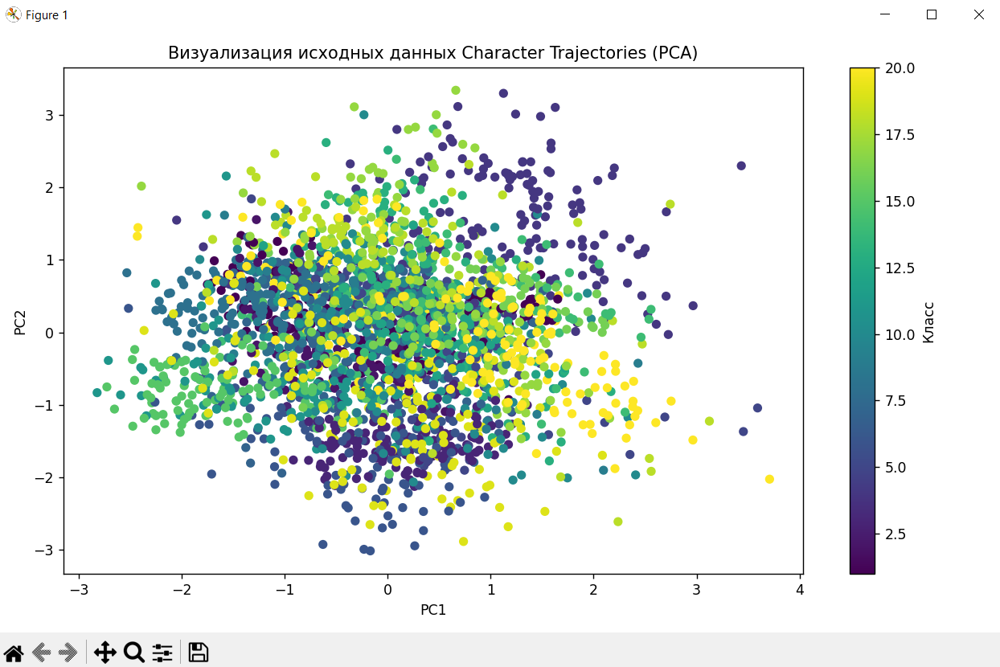
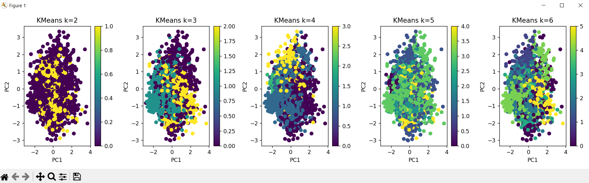
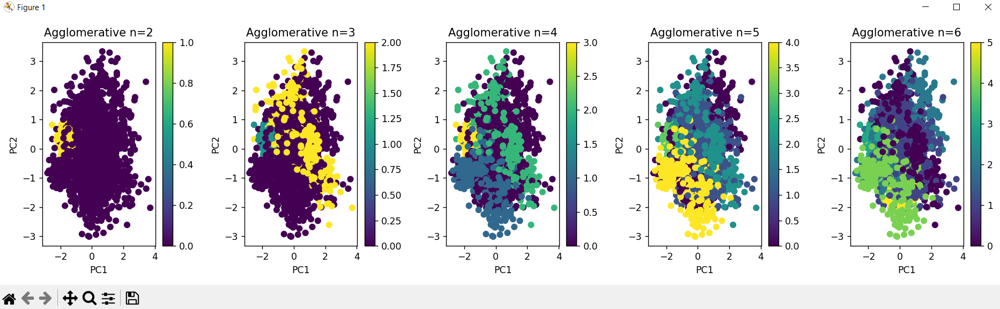
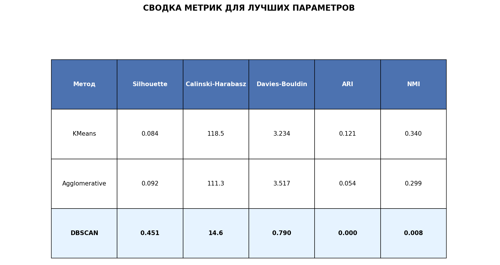

# Лабораторная работа 5. Алгоритмы кластеризации данных
## Задание
Перед выполнением лабораторной работы необходимо загрузить набор данных в соответствии с вариантом на диск.

1. Произвести масштабирование признаков (scaling).
2. С использованием библиотеки scikit-learn написать программу с использованием алгоритмов кластеризации данных, позволяющую разделить исходную выборку на классы, соответствующие предложенной вариантом задаче (http://scikit-learn.org/stable/modules/clustering.html).
3. Провести эксперименты и определить наилучший алгоритм кластеризации, параметры алгоритма. Необходимо использовать не менее 3-х алгоритмов. Данные экспериментов необходимо представить в отчете (графики, ход проведения эксперимента, выводы).
## Вариант 4
Character Trajectories
набор данных, содержащий траектории движений пера при написании 20 различных символов английского алфавита. Каждая траектория представляет собой последовательность точек в трёхмерном пространстве, записанную во времени.

## Загрузка dataset и его подготовка
```
# Загрузка данных
mat_file = 'mixoutALL_shifted.mat'
try:
    X, y = load_character_trajectories_fixed(mat_file)
except Exception as e:
    print(f"Ошибка при загрузке данных: {e}")
    exit(1)

print(f"\nРазмерность данных: {X.shape}")
if y is not None:
    print(f"Уникальные классы: {np.unique(y)}")
    print(f"Количество классов: {len(np.unique(y))}")

# Применяем PCA для уменьшения размерности до разумного уровня
pca_reduce = PCA(n_components=0.95)
X_reduced = pca_reduce.fit_transform(X)
print(f"\nПосле PCA (95% дисперсии): {X_reduced.shape[1]} признаков")
print(f"Сохраненная дисперсия: {pca_reduce.explained_variance_ratio_.sum():.2%}")

# Масштабируем признаки
scaler = StandardScaler()
X_scaled = scaler.fit_transform(X_reduced)
X_scaled_dense = X_scaled
```
## Визуализация данных
```
# Визуализация данных после PCA (2D для визуализации)
pca = PCA(n_components=2)
X_pca = pca.fit_transform(X_scaled_dense)

plt.figure(figsize=(10, 6))
if y is not None:
    plt.scatter(X_pca[:, 0], X_pca[:, 1], c=y, cmap='viridis', s=30)
else:
    plt.scatter(X_pca[:, 0], X_pca[:, 1], s=30)
plt.title("Визуализация исходных данных Character Trajectories (PCA)")
if y is not None:
    plt.colorbar(label='Класс')
plt.xlabel('PC1')
plt.ylabel('PC2')
plt.tight_layout()
plt.show()
```

## Функция для оценки кластеризации
```
def evaluate_clustering(model, data, true_labels=None):
    """
    Оценка качества кластеризации с расширенными метриками
    """
    labels = model.fit_predict(data)

    # Проверка, что есть более 1 кластера
    if len(set(labels)) > 1 and -1 in labels:
        core_labels = labels[labels != -1]
        core_data = data[labels != -1]
        silhouette = silhouette_score(core_data, core_labels)
        calinski = calinski_harabasz_score(core_data, core_labels)
        davies = davies_bouldin_score(core_data, core_labels)
    elif len(set(labels)) > 1:
        silhouette = silhouette_score(data, labels)
        calinski = calinski_harabasz_score(data, labels)
        davies = davies_bouldin_score(data, labels)
    else:
        silhouette = -1
        calinski = -1
        davies = float('inf')

    # Метрики, требующие истинные метки
    if true_labels is not None:
        ari = adjusted_rand_score(true_labels, labels)
        nmi = normalized_mutual_info_score(true_labels, labels)
    else:
        ari = -1
        nmi = -1

    return labels, silhouette, calinski, davies, ari, nmi
```

## Метод кластеризации - KMeans

```
print("\n" + "=" * 60)
print("KMeans кластеризация")
print("=" * 60)

kmeans_params = [2, 3, 4, 5, 6]
best_score_kmeans = -1
best_kmeans = None
best_labels_kmeans = None
best_k = None
labels_for_k = []
metrics_kmeans = []

for k in kmeans_params:
    kmeans = KMeans(n_clusters=k, random_state=42, n_init=10)
    labels, silhouette, calinski, davies, ari, nmi = evaluate_clustering(kmeans, X_scaled_dense, y)
    print(f'KMeans с k={k}:')
    print(f'  Silhouette: {silhouette:.3f}, Calinski-Harabasz: {calinski:.1f}, Davies-Bouldin: {davies:.3f}')
    if y is not None:
        print(f'  ARI: {ari:.3f}, NMI: {nmi:.3f}')

    labels_for_k.append(labels)
    metrics_kmeans.append({'silhouette': silhouette, 'calinski': calinski, 'davies': davies, 'ari': ari, 'nmi': nmi})

    if silhouette > best_score_kmeans:
        best_score_kmeans = silhouette
        best_kmeans = kmeans
        best_labels_kmeans = labels
        best_k = k

print(f'\nЛучшее число кластеров для KMeans: {best_k} с коэффициентом: {best_score_kmeans:.3f}')

# Визуализация для каждого k
fig, axes = plt.subplots(1, len(kmeans_params), figsize=(15, 4))
for i, k in enumerate(kmeans_params):
    labels = labels_for_k[i]
    scatter = axes[i].scatter(X_pca[:, 0], X_pca[:, 1], c=labels, cmap='viridis')
    axes[i].set_title(f'KMeans k={k}')
    axes[i].set_xlabel('PC1')
    axes[i].set_ylabel('PC2')
    plt.colorbar(scatter, ax=axes[i])

plt.tight_layout()
plt.show()
```


## Метод кластеризации - Agglomerative Clustering

```
agg_params = [2, 3, 4, 5, 6]
best_score_agg = -1
best_labels_agg = []
best_n_agg = None
labels_list = []
metrics_agg = []

for n in agg_params:
    agg = AgglomerativeClustering(n_clusters=n)
    labels, silhouette, calinski, davies, ari, nmi = evaluate_clustering(agg, X_scaled_dense, y)
    print(f'Agglomerative с n_clusters={n}:')
    print(f'  Silhouette: {silhouette:.3f}, Calinski-Harabasz: {calinski:.1f}, Davies-Bouldin: {davies:.3f}')
    if y is not None:
        print(f'  ARI: {ari:.3f}, NMI: {nmi:.3f}')

    labels_list.append(labels)
    metrics_agg.append({'silhouette': silhouette, 'calinski': calinski, 'davies': davies, 'ari': ari, 'nmi': nmi})

    if silhouette > best_score_agg:
        best_score_agg = silhouette
        best_labels_agg = labels
        best_n_agg = n

print(f'\nЛучшее число кластеров для Agglomerative: {best_n_agg} с коэффициентом: {best_score_agg:.3f}')

# Визуализация для всех вариантов
fig, axes = plt.subplots(1, len(agg_params), figsize=(15, 4))
for i, n in enumerate(agg_params):
    labels = labels_list[i]
    scatter = axes[i].scatter(X_pca[:, 0], X_pca[:, 1], c=labels, cmap='viridis')
    axes[i].set_title(f'Agglomerative n={n}')
    axes[i].set_xlabel('PC1')
    axes[i].set_ylabel('PC2')
    plt.colorbar(scatter, ax=axes[i])

plt.tight_layout()
plt.show()
```



## Метод кластеризации - DBSCAN

```
# Используем более подходящие параметры для наших данных
dbscan_params = [
    (0.5, 5), (1.0, 5), (1.5, 5), (2.0, 5),
    (0.5, 10), (1.0, 10), (1.5, 10), (2.0, 10),
    (2.5, 10), (3.0, 10)
]

best_score_dbscan = -1
best_labels_dbscan = None
best_eps = None
best_min_samples = None
dbscan_results = []
metrics_dbscan = []

for eps, min_samples in dbscan_params:
    dbscan = DBSCAN(eps=eps, min_samples=min_samples)
    labels, silhouette, calinski, davies, ari, nmi = evaluate_clustering(dbscan, X_scaled_dense, y)

    # Подсчитываем количество кластеров (исключая шум -1)
    n_clusters = len(set(labels)) - (1 if -1 in labels else 0)

    print(f'DBSCAN с eps={eps}, min_samples={min_samples}, Силуэтный коэффициент: {silhouette:.3f}')

    metrics_dbscan.append({
        'eps': eps,
        'min_samples': min_samples,
        'silhouette': silhouette,
        'calinski': calinski,
        'davies': davies,
        'ari': ari,
        'nmi': nmi,
        'n_clusters': n_clusters
    })

    if silhouette > best_score_dbscan and n_clusters >= 2:
        best_score_dbscan = silhouette
        best_labels_dbscan = labels
        best_eps = eps
        best_min_samples = min_samples

    # Сохраняем для визуализации
    if n_clusters >= 2 and len(dbscan_results) < 4:
        dbscan_results.append((eps, min_samples, labels, silhouette, n_clusters))

if best_eps is not None:
    print(f'\nЛучший DBSCAN: eps={best_eps}, min_samples={best_min_samples} с коэффициентом: {best_score_dbscan:.3f}')
else:
    print("\nDBSCAN не смог найти хорошую кластеризацию с заданными параметрами")

# Визуализация нескольких лучших вариантов DBSCAN
n_dbscan_to_show = min(5, len(dbscan_results))
if n_dbscan_to_show > 0:
    fig, axes = plt.subplots(1, n_dbscan_to_show, figsize=(15, 4))

    # Если только 1 график
    if n_dbscan_to_show == 1:
        axes = [axes]

    for i in range(n_dbscan_to_show):
        eps, min_samples, labels, score, n_clusters = dbscan_results[i]
        scatter = axes[i].scatter(X_pca[:, 0], X_pca[:, 1], c=labels, cmap='viridis')
        axes[i].set_title(f'DBSCAN\neps={eps}, min={min_samples}')
        axes[i].set_xlabel('PC1')
        axes[i].set_ylabel('PC2')
        plt.colorbar(scatter, ax=axes[i])

    plt.tight_layout()
    plt.show()

```


## Визуализация лучших методов

```
# Находим лучшие метрики для каждого метода
best_metrics_kmeans = next(m for i, m in enumerate(metrics_kmeans) if kmeans_params[i] == best_k)
best_metrics_agg = next(m for i, m in enumerate(metrics_agg) if agg_params[i] == best_n_agg)

if best_eps is not None:
    best_metrics_dbscan = next(
        m for m in metrics_dbscan if m['eps'] == best_eps and m['min_samples'] == best_min_samples)
else:
    best_metrics_dbscan = None

# Визуализация лучших результатов каждого метода
fig, axes = plt.subplots(1, 3, figsize=(15, 4))

# Лучший KMeans
if best_labels_kmeans is not None:
    scatter1 = axes[0].scatter(X_pca[:, 0], X_pca[:, 1], c=best_labels_kmeans, cmap='viridis')
    axes[0].set_title(f'KMeans (k={best_k})\nSilhouette: {best_score_kmeans:.3f}')
    axes[0].set_xlabel('PC1')
    axes[0].set_ylabel('PC2')
    plt.colorbar(scatter1, ax=axes[0])

# Лучший Agglomerative
if best_labels_agg is not None:
    scatter2 = axes[1].scatter(X_pca[:, 0], X_pca[:, 1], c=best_labels_agg, cmap='viridis')
    axes[1].set_title(f'Agglomerative (n={best_n_agg})\nSilhouette: {best_score_agg:.3f}')
    axes[1].set_xlabel('PC1')
    axes[1].set_ylabel('PC2')
    plt.colorbar(scatter2, ax=axes[1])

# Лучший DBSCAN
if best_labels_dbscan is not None:
    scatter3 = axes[2].scatter(X_pca[:, 0], X_pca[:, 1], c=best_labels_dbscan, cmap='viridis')
    axes[2].set_title(f'DBSCAN (eps={best_eps}, min={best_min_samples})\nSilhouette: {best_score_dbscan:.3f}')
    axes[2].set_xlabel('PC1')
    axes[2].set_ylabel('PC2')
    plt.colorbar(scatter3, ax=axes[2])

plt.tight_layout()
plt.show()
```
## Определение лучшего метода

```
# Определяем лучший алгоритм
scores = {
    'KMeans': best_score_kmeans,
    'Agglomerative': best_score_agg,
    'DBSCAN': best_score_dbscan if best_eps is not None else -1
}

best_method = max(scores, key=scores.get)
best_score = scores[best_method]

print(f"\nЛУЧШИЙ АЛГОРИТМ: {best_method}")
print(f"Silhouette Score: {best_score:.3f}")
```




